# Architecture Overview

This document provides a comprehensive overview of the AI Agent Orchestration Platform architecture.

## Table of Contents

- [High-Level Architecture](#high-level-architecture)
- [Component Diagram](#component-diagram)
- [Data Flow](#data-flow)
- [Deployment Architecture](#deployment-architecture)
- [Security Architecture](#security-architecture)
- [Scalability Architecture](#scalability-architecture)

---

## High-Level Architecture

The platform follows a microservices architecture with clear separation of concerns:

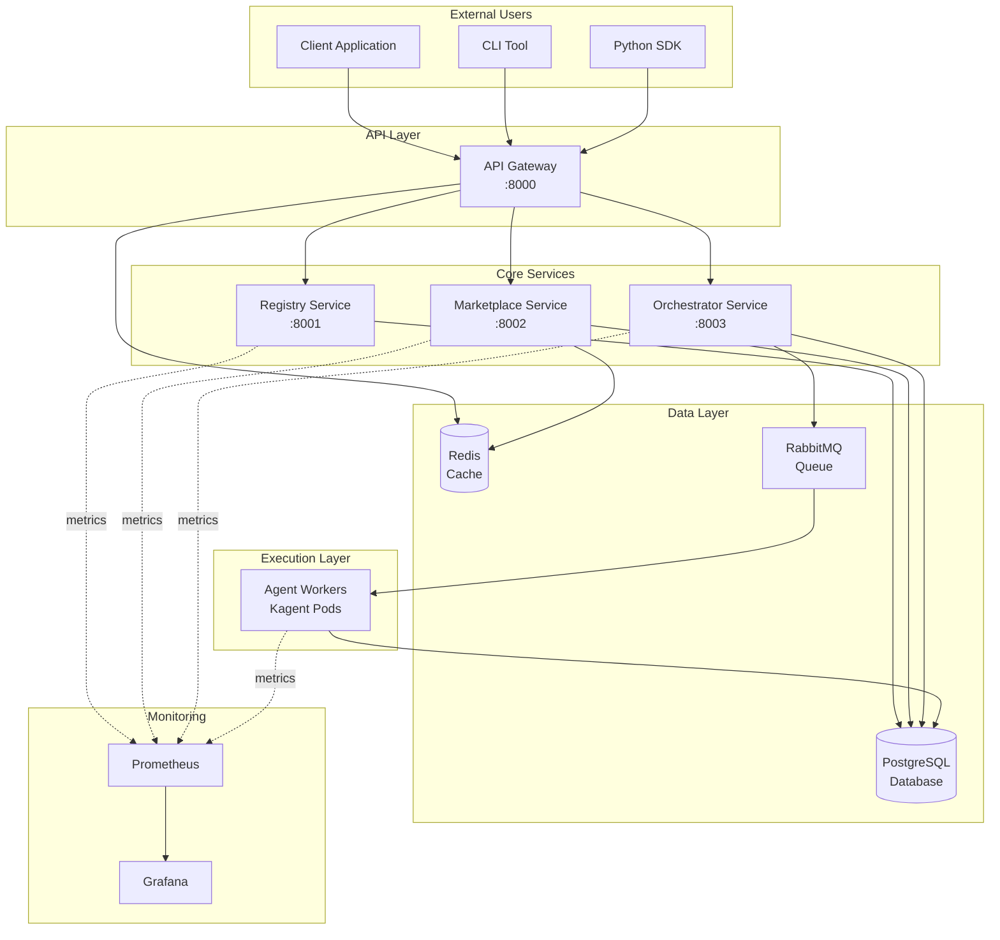

---

## Component Diagram

### Detailed Service Breakdown

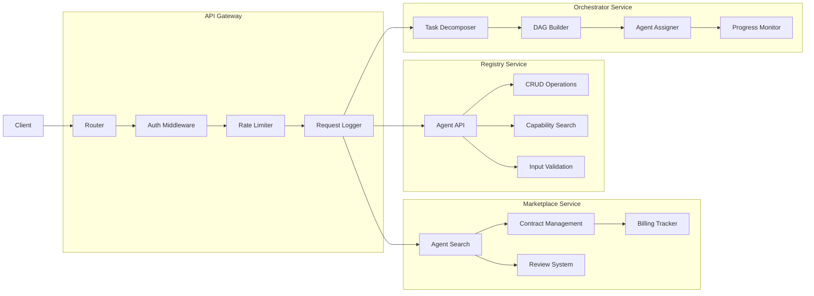

---

## Data Flow

### Task Execution Flow

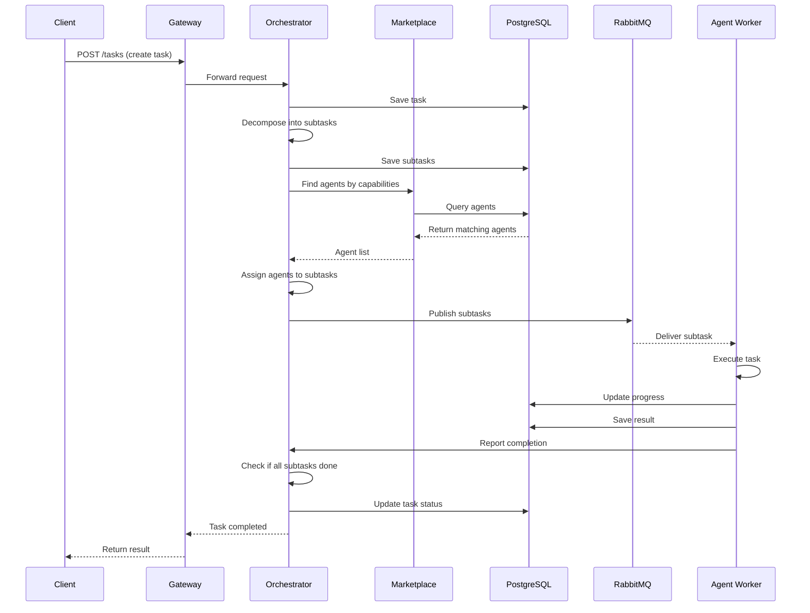

### Agent Registration Flow

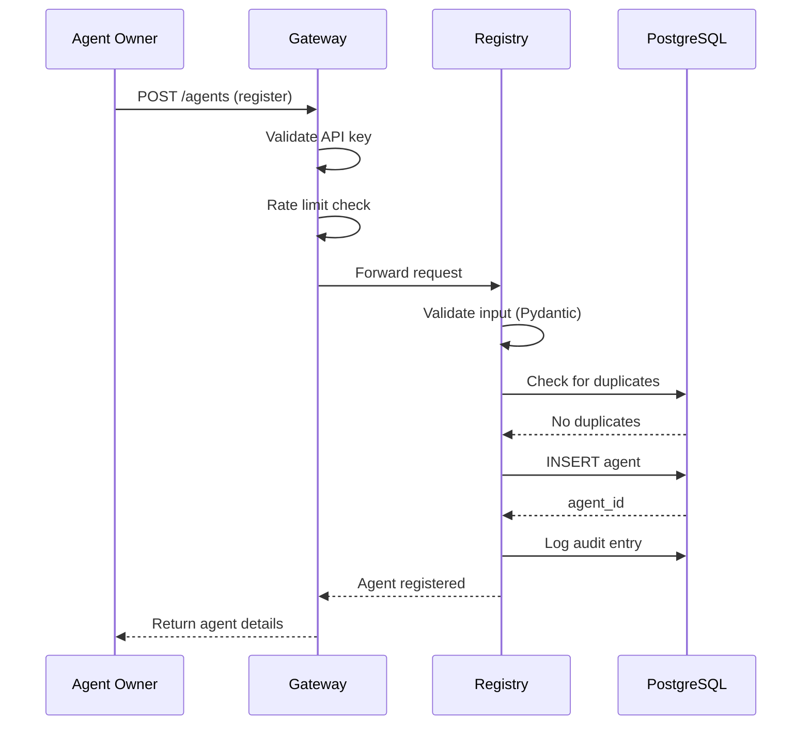

---

## Deployment Architecture

### Kubernetes Deployment

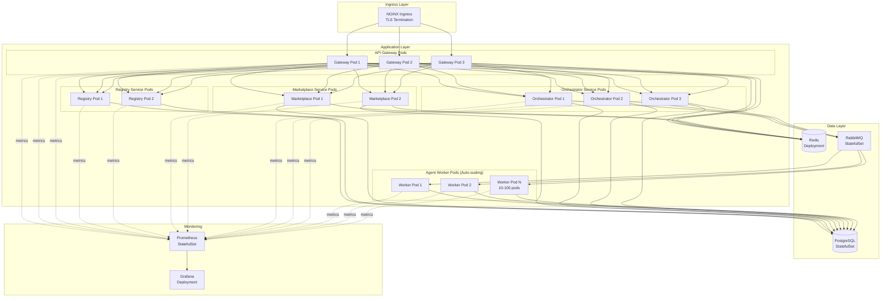

### Horizontal Pod Autoscaling (HPA)

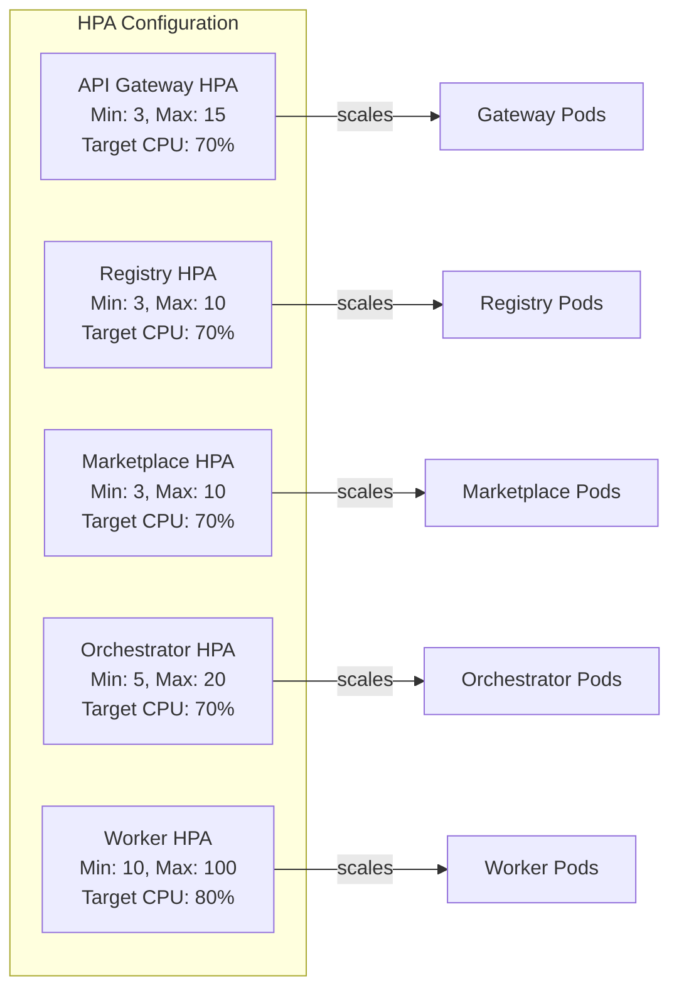

---

## Security Architecture

### Multi-Layer Security

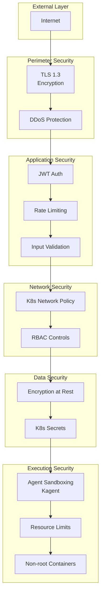

### Authentication Flow

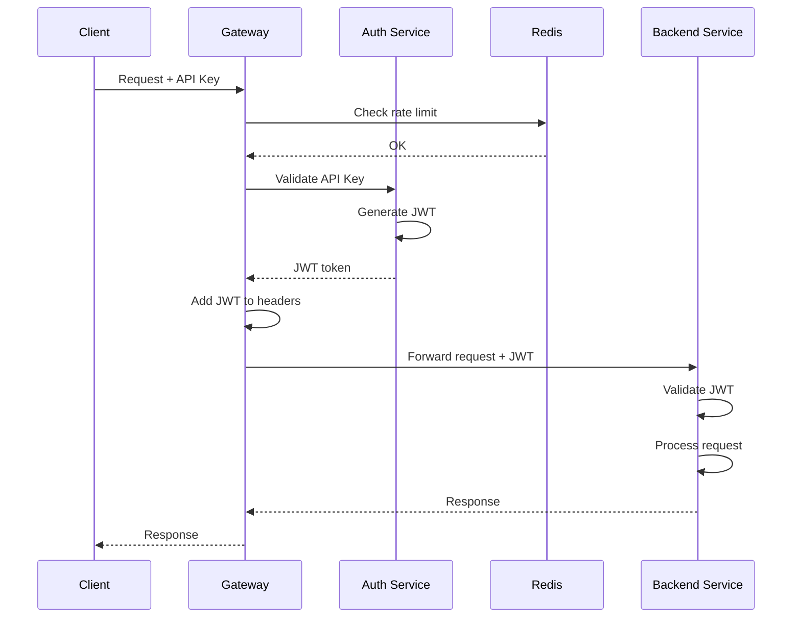

---

## Scalability Architecture

### Load Distribution

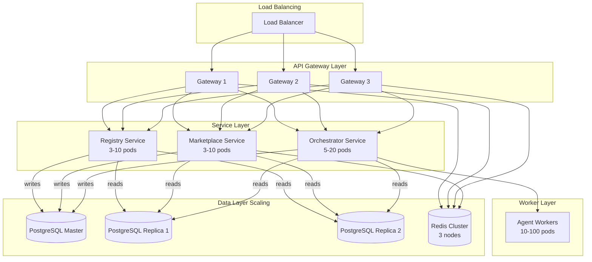

---

## Database Schema

### Entity Relationship Diagram

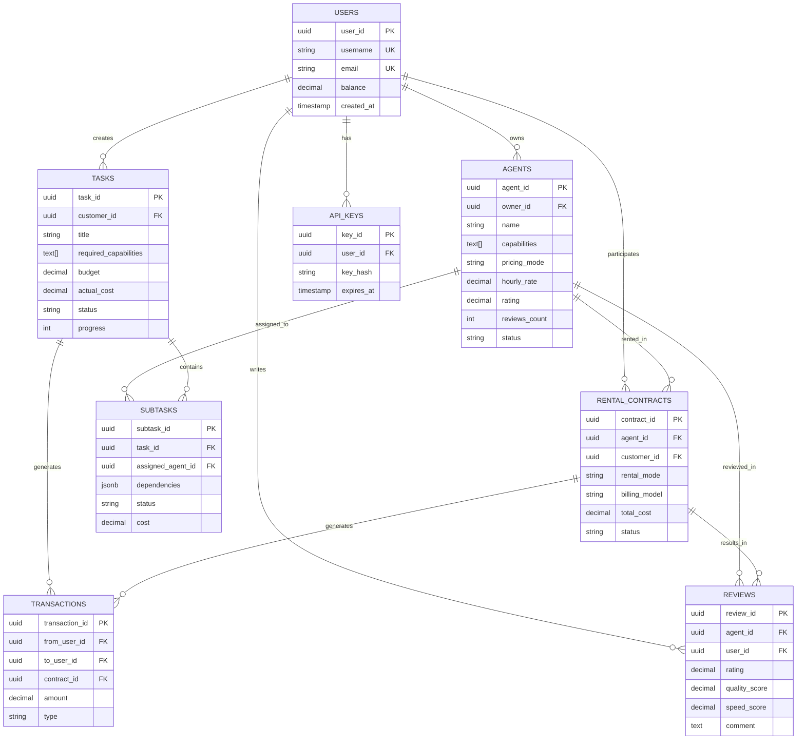

---

## Technology Stack

### Backend Stack

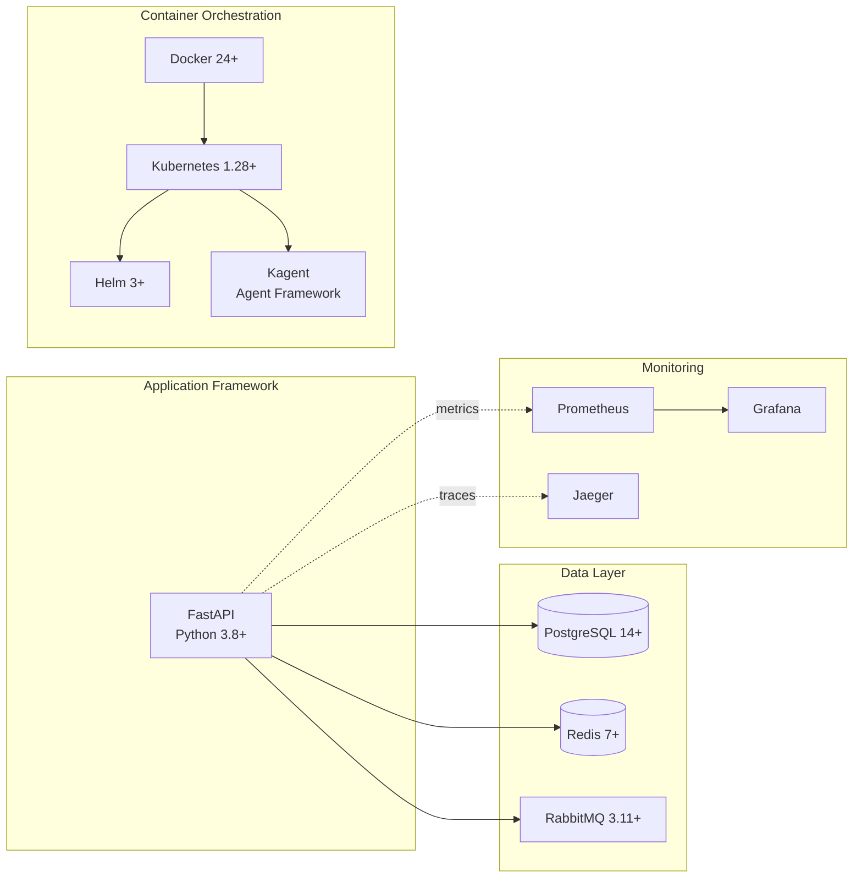

---

## Deployment Models

### Development

```
Docker Compose
├── All services in single host
├── Single instance per service
└── Local volumes for data
```

### Staging

```
Kubernetes (single cluster)
├── Multi-pod deployment
├── HPA with lower limits
└── Shared database instance
```

### Production

```
Kubernetes (multi-cluster)
├── Multi-region deployment
├── HPA with production limits
├── Database replication
├── CDN for static assets
└── Multi-AZ availability
```

---

## Performance Characteristics

### Latency Targets

- **API Gateway**: < 10ms (p99)
- **Registry Service**: < 50ms (p99)
- **Marketplace Search**: < 100ms (p99)
- **Task Creation**: < 200ms (p99)
- **Agent Worker Task Execution**: Variable (task-dependent)

### Throughput Targets

- **API Gateway**: 10,000 req/sec
- **Agent Registration**: 100 req/sec
- **Task Creation**: 500 req/sec
- **Concurrent Workers**: 100+ agents

### Scalability Limits

- **Max Concurrent Tasks**: 10,000+
- **Max Registered Agents**: 100,000+
- **Max Concurrent Workers**: 1,000+ (with auto-scaling)
- **Database Connections**: 1,000 (pooled)

---

## References

- [Kubernetes Architecture](https://kubernetes.io/docs/concepts/architecture/)
- [FastAPI Documentation](https://fastapi.tiangolo.com/)
- [PostgreSQL High Availability](https://www.postgresql.org/docs/current/high-availability.html)
- [Prometheus Operator](https://prometheus-operator.dev/)
- [Kagent Framework](https://kagent.dev/)
